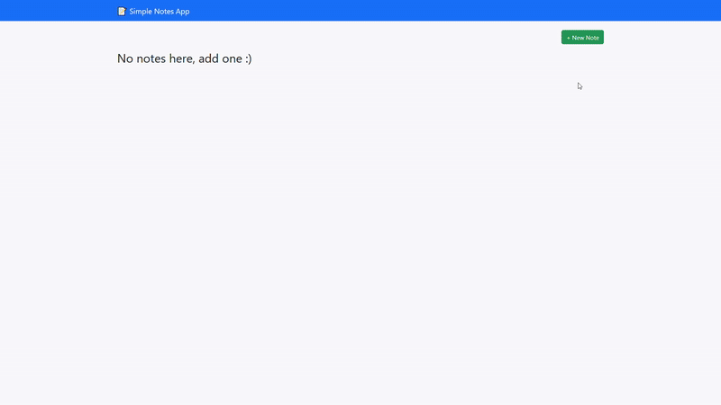

# 🗒️ Java Notes App — Layered Architecture
## Demo

## ⚙️ Dependencies Used

- **Spring Web**
- **Spring DevTools**
- **Thymeleaf**
- **MySQL Driver**
- **Spring Data JPA**

---

## 🧩 Architecture Overview

A **Java Notes App** implemented using a **Layered Architecture**:

### Layers

| Layer | Description |
|:------|:-------------|
| **Presentation Layer** | Handles HTTP requests → `Controllers` |
| **Service Layer** | Coordinates calls between layers |
| **Repository Layer** | Interfaces with the database via JPA (CRUD only) |

---

## 🗂️ Project Structure

```
com.example.notesapp
├── controller    → Handles HTTP requests
├── service       → Business logic
├── repository    → Database access (JPA)
├── model         → Entity classes
```

---

# 🧭 Development Plan

### 1️⃣ Define the Data Entity
Create the `Note` entity class using **JPA annotations** to map it to your database table.

**Example fields:**
```java
long id;
String title;
String content;
boolean isPinned;
LocalDateTime createdAt;
LocalDateTime updatedAt;
```

---

### 2️⃣ Set Up the MySQL Database
- Create a new MySQL database schema for storing notes data.

---

### 3️⃣ Configure Spring Boot to Connect to MySQL
Add connection properties to your `application.properties` or `application.yml`:

```properties
spring.datasource.url=jdbc:mysql://localhost:3306/notesdb
spring.datasource.username=root
spring.datasource.password=yourpassword
spring.jpa.hibernate.ddl-auto=update
```

Make sure the **MySQL driver dependency** is included.

---

### 4️⃣ Create the Repository Interface
Define an interface to handle CRUD operations:

```java
public interface NoteRepository extends JpaRepository<NoteEntity, Long> {}
```

---

### 5️⃣ Run the Application
When you run your Spring Boot app, **JPA/Hibernate** will automatically generate the `notes` table based on your entity class.

---

## 🧱 What is an Entity?

An **Entity** is a Java class representing a **database table**.  
Each instance of the entity corresponds to one row in that table.

**Example:**
| Field | Type | Description |
|:------|:------|:-------------|
| `id` | `long` | Primary key |
| `title` | `String` | Note title |
| `content` | `String` | Note content |
| `createdAt` | `LocalDateTime` | Creation timestamp |
| `updatedAt` | `LocalDateTime` | Last update timestamp |
| `isPinned` | `boolean` | Whether the note is pinned |

> `updatedAt` and `isPinned` help with sorting and prioritizing notes.

---

## 🧰 What is the Repository Interface?

An **abstraction layer** for performing **CRUD** operations on entities.  
It allows you to access and manipulate data without writing SQL directly.

**Example:**
```java
public interface NoteRepository extends JpaRepository<NoteEntity, Long> {}
```

The `CRUDService` class uses this repository to interact with the database.

---

## 🎯 What is the Controller?

The **Controller** is the entry point for HTTP requests — it connects the **frontend** with your **backend**.

**Responsibilities:**
- Accepts requests (`GET`, `POST`, `PUT`, `DELETE`)
- Maps them to Java methods
- Interacts with the service layer
- Returns HTML views or JSON responses
---
